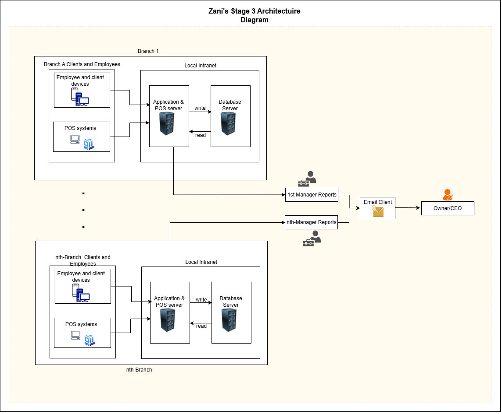
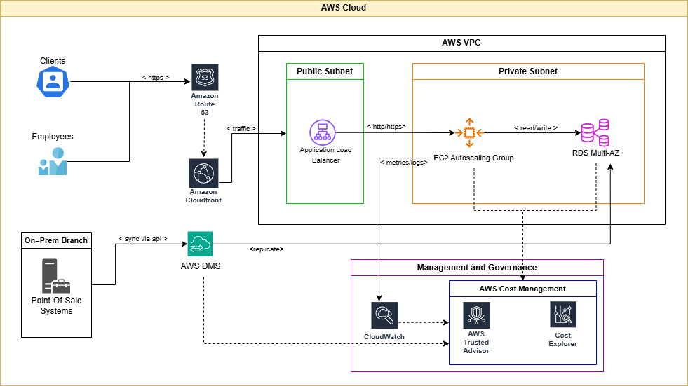
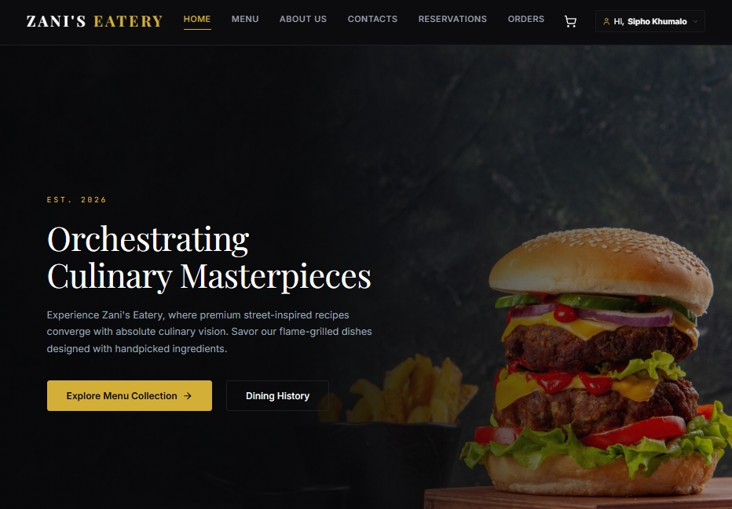
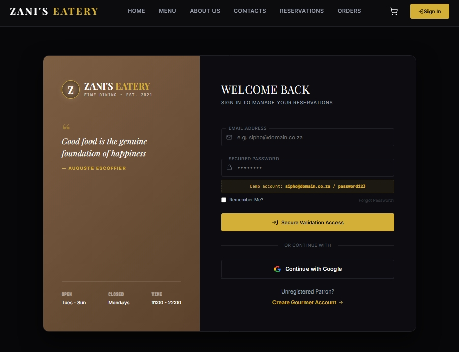
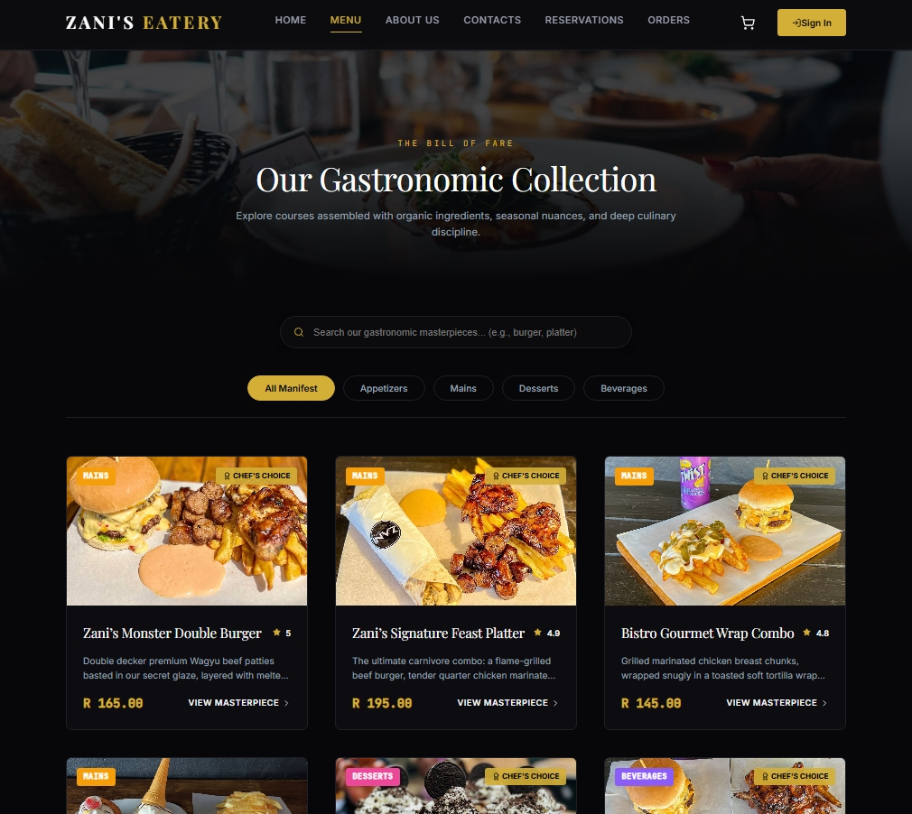
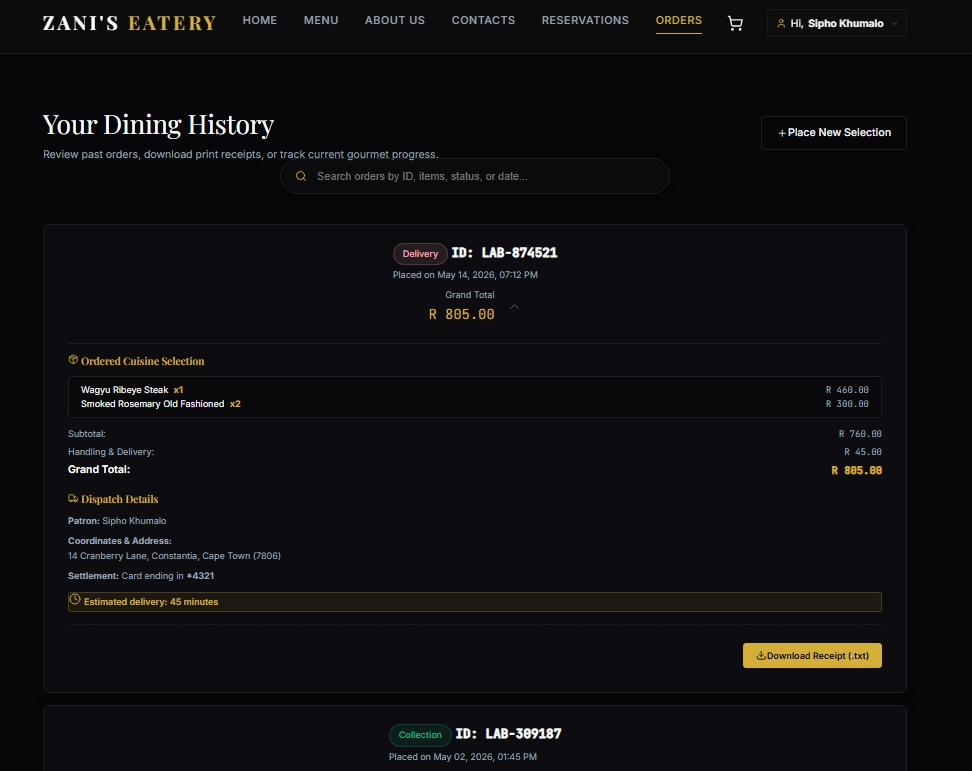
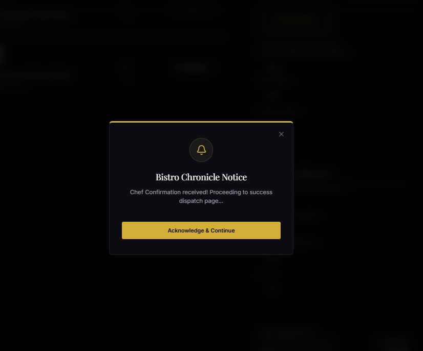
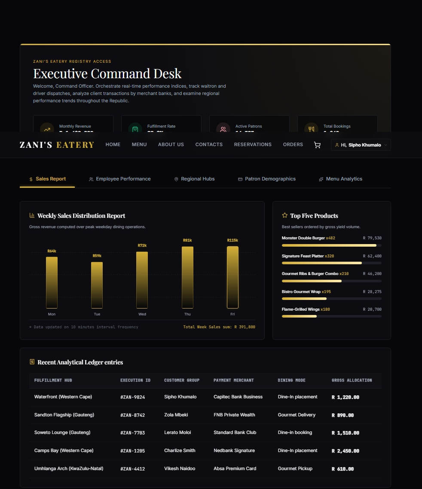
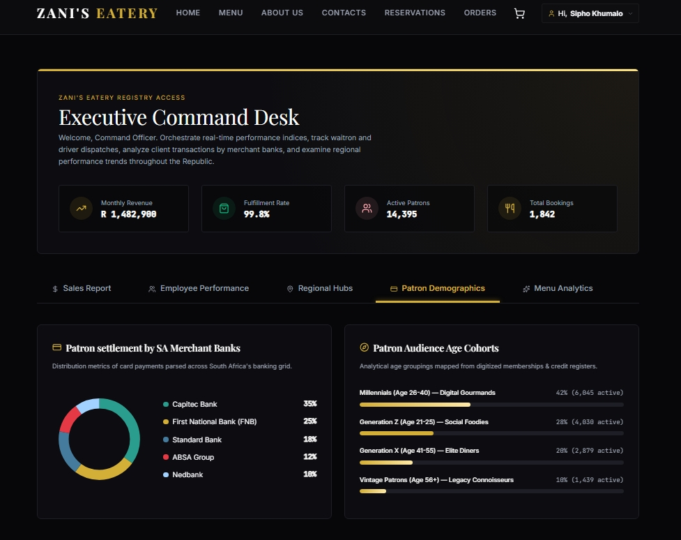

## Authors
---

View Contributors/Authors

> aka Group 3 

- Masekela Isaac Maake  

- Phillip Thwala  

- Feziwe Mazibuko  

- Gugulethu Oliphant  

- Mr. Phadagi  

- Frans Moifa Phala
 

---

## An AWS Capstone project to host a static Website in Amazon S3.
---

### Introduction
The aim of this project is to take you through the journey of Zani's restaurant from a restaurant operating in the townships to its glory days of operating World wide in multiple countries. As cloud practitioners, we are tasked with finding solutions to Zani's I.T issues and painpoints using AWS Cloud Services.

The aim is also to encourage businesses to adopt tech to take advantage of global reach and expansion, where AWS Cloud Services can help them in achieving such a goal.

Although the website will be hosted on AWS S3 only with no other services interacting/connected to it due for financial reasons, the AWS contributors on this project would like to demonstrate their experties of AWS services and cover most ground. Section one will address the the journey, the pain points and requirements, whilst section 2 will adress and justify the AWS possible solutions.

---

### 1. Business Context & Requirements
In this section we introduce Zani's restaurant and walk you throught eh major changes as the restaurant grows. Taking note of the challenges faced at each stage which make up some of the requirements Zani's restaurant that will be solved using AWS solutions.
#### 1.1 Stage 1: In The Beginnig.
Zanis's restaurant was founded in the __ township. Currently the business is operated by 15 individuals, including Zani. The people in the area love visiting her place and on certain days they are usually very busy. She has been attracting a lot of people in the area.

Zani is not a tech-pro, but she is aware of the missed opportunities due to not taking advantage of technology as its popular with her major clients, the youth, and knows it will make her job easier. The manual consolidation throughout all processes is tiring and errornous, and marketing restaurant manually does not make a difference. Zani consults with Group 3 members and she learns the following about not having her own website and internal System:

**Motivation To Adopt Technology**  

-  **Website**: Creates a professional digital presence beyond the township. Allows customers from Joburg, Pretoria, or tourists to discover the restaurant. Enables online menu viewing, promotions, location/directions, customer reviews, and online ordering/delivery partnerships (e.g., with Mr D or Uber Eats integration).  

- **Internal System/App**: Digitizes manual processes (paper pads, Excel, WhatsApp orders). Improves accuracy in orders, reduces theft/wastage in stock, automates payroll, provides real-time sales reports, and supports better decision-making.  

**Missed Opportunities**:  
 - Limited customer reach (local word-of-mouth).
- High manual errors (wrong orders, stockouts).
- Poor data visibility (owner doesn't know real profitability per item).
- Inefficient staffing and payroll disputes.
- Lost revenue from online delivery market.
- Difficulty scaling or attracting investors/franchisees.
- Weak brand building and customer loyalty tracking.
- Competitive disadvantage against restaurants that appear modern on Google/Facebook.

#### 1.2 Stage 2: Technology Adoption.
Zani now considers technology adoption due to the enormous amount of opportunities and growth being missed. She starts small with a point os sale system and a web application for customers and internal employees (separated by roles) running on servers on the local intranet. The web application is used by all the employees for their specific roles such as timesheets, analytics for managers, and so on. Customers use the web application to make orders The architecture is as follows:

They realized the following benefits from technology adoption:  

**Web application for users**
- 24/7 visibility and marketing (SEO, Google My Business).
- Online ordering and reservations increases sales by giving the customers the flexibility of using the service.
- Customer feedback and reviews for improvement.
- Ability to showcase specials, events, and cultural offerings.
- Partnerships with delivery platforms.

**Internal Web Application for Employees**
- Real-time inventory alerts and management.
- Faster order processing and kitchen efficiency.
- Accurate payroll and shift management.
- Sales analytics (best-selling items, peak hours, etc).
- Reduced cash leakage and better cash flow control as everything goes through the system and is stored in the servers.
- Staff performance tracking.

Things are going well and Zani's business is experiencing greater growth and managing the business is now much better. 

#### 1.3 Stage 3: Business Expansion.
Zani's technology adoption has allowed the business to reach all customers across South Africa and the neighbouring countries. She has multiple(~20) branches in every country and they are still relying on the old setup for each branch. Due to the expansion as a result of technology adoption, the following advantages are visible: 

- Economies of scale in purchasing (better supplier deals).
- Brand recognition across multiple townships/suburbs.
Risk diversification, when one branch underperforms, others compensate.
- Increased revenue streams and market share.
- Career growth for staff (promotion opportunities).

Below is the updated architecture diagram for stage 3:

Zani now relies on each branch manager's reports sumbitted via email for insights into the branch performance. Although things are better compared to when they started, they now face new challenges as follows:

- **Data Silos**: No central view of total business performance.
- **Inconsistency**: Different pricing, menus, quality standards, or promotions across branches.
- **High duplication costs** due to Buying/maintaining separate servers, software licenses, and hardware per branch.
- **Poor scalability**: Adding a new branch means setting up everything again.
- **Difficulty in central reporting**: Owner/manager must manually consolidate Excel reports or visit branches.
- **Higher security risk**: Each system is a potential weak point.
- **Inefficient resource allocation**: Stock, staff, or marketing cannot be easily shifted between branches.
- **Time wasted** on **manual consolidations** and travel between branches.
- Customers are faced with **Inconsistent experience** across the different branches.
- Difficulty enforcing standard operating procedures
- Delivery/ordering confusion
- IT teams are faced with mantaining multiple separate systems.
- Difficulty implementing new features.
- Expensive and complex disaster recovery.
- High workload and burnout for the IT team.

At this point its quite obvious from the management and IT team that the restaurant company has outgrown the separate systems model. Moving to a cloud-based central system (e.g., using Azure/AWS with local partners) would solve most of these issues by providing centralized control while allowing offline functionality for load-shedding. Zani consults with AWS cloud practitioners for suitable solutions.

#### 1.4 Business requirements vs AWS Solutions
From the scenarios of Zani's business above, the issues(requirements) were identified and the appropriate AWS service for each:  

1. **Compute & Application Modernisation**

**AWS services**:

- Amazon EC2: provides app and storage servers
- Elastic Load Balancing (ELB): Balancing the networks traffic across instances
- Auto Scaling Groups: Scale based on targeted metrics
- AWS Lambda (serverless compute): move trigger based, periodic and spiky processes that can complete under 15 minutes (e.g payroll processing for all employees during month end)

**Issues addressed**:

- System downtime during peak load
- Application server overload
- Slow POS processing during busy hours
- Poor system performance under high traffic
- Single point of failure in local servers
- Limited scalability as business grows
- High maintenance overhead per branch
- Version inconsistencies between branch systems
- Delayed response times in internal apps
- Inability to handle sudden spikes in demand
- Inefficient resource utilization (over/under provisioning)

2. **Storage & Data Reliability**

**AWS services**:

- Amazon S3 (object storage) with intelligent tiering: product images, user profile photos, tutorial videos etc.
- AWS Backup: Operational data backup for disaster recovery.
- Amazon RDS: suitable for restaurant POS data store and the web application.

**Issues addressed**:

- Data loss during power outages
- Lack of automated backups
- High risk of hardware failure causing data loss
- Inconsistent or missing branch data
- Manual backup processes
- Limited disaster recovery capability
- Difficulty maintaining data durability
- Hardware storage limitations per branch

3. **Data Migration & Synchronisation**

**AWS services**:

- AWS DataSync: Sync the data between on-prem and AWS without disrupting the restaurant operations.
- AWS Migration Evaluator: Analyse and strategise the migration of data from on-prem to AWS.
- AWS Database Migration Service (DMS): a service for data migration

**Issues addressed**:

- Difficulty consolidating branch data
- Manual reporting errors
- Data inconsistency between branches
- Slow or unreliable data transfer between systems
- Risk of data loss during migration
- Difficulty onboarding new branches into a shared system

4. **Monitoring, Security & Identity**

**AWS services**:

- Amazon CloudWatch: watches your AWS resources and apps, collects data, and alerts you when things go wrong
- AWS IAM (Identity & Access Management): Configure who can access and take which action(s) on cloud resources

**Issues addressed**:

- Lack of centralized monitoring
- No audit trails for system activity
- Security vulnerabilities due to local-only access control
- Credential sharing among employees
- Lack of role-based access control enforcement
- Poor security governance across branches

5. **Networking & Connectivity**

**AWS services**:

- Amazon VPC (network isolation model)

**Issues addressed**:

- Branch isolation and lack of centralized communication
- Network failures within branches disrupting operations
- Inability to securely connect distributed systems
- Limited remote access capabilities
- Poor inter-system communication reliability

6. **Cost Monitoring & Financial Governance**
Useful services for the IT managers to monitor the cost of resources usage in AWS.

**AWS services**:

- AWS Cost Explorer
- AWS Budgets
- AWS Cost & Usage Report (CUR)
- AWS Trusted Advisor

**Issues addressed**:
- No visibility into IT spending across branches
- Difficulty tracking cost per system or workload
- Risk of overspending due to uncontrolled scaling (compute/storage growth)
- Lack of budgeting per branch
- No alerts when infrastructure costs spike
- Poor financial planning for IT infrastructure
- Inefficient resource usage leading to wasted compute/storage
- No accountability for usage at branch level or team level
- Difficulty forecasting IT expansion costs as business grows

A fully on-prem, decentralized restaurant system introduces major risks in power reliability, performance under peak load, data accuracy, and operational visibility. Cloud services can help address most of these issues. 

#### 1.5 The Proposed AWS Solution
The solution as shown in the below diagram can be implemented for the comapny:

This architecture is suitable for the restaurant company because it provides a **scalable, secure, and highly available system** while **allowing a gradual migration** from on-premises branch systems without disrupting operations.

It ensures high availability, performance, and security for the restaurant system by using load balancing and auto scaling to handle peak traffic periods such as busy dining hours. The use of a Multi-AZ database guarantees continuous operation even during failures, while the VPC design with public and private subnets protects sensitive data by isolating core components from direct internet access. Additionally, services like Route 53 and CloudFront improve user experience by enabling fast and reliable access to applications across different locations.

At the same time, the solution enables seamless data migration and centralized data management through AWS DMS and RDS, eliminating inconsistencies between branches and supporting real-time reporting. Monitoring tools like CloudWatch provide visibility into system performance, while cost management services such as Cost Explorer and Trusted Advisor help control spending.  

---

### 2. The Hosted Website
The wbsite is accessed at [Click Here](http://aws-restart-03.s3-website.af-south-1.amazonaws.com). Note that the site may not be available due to costs.

#### 2.1 Website Features

- **Landing Page**

- **Login Page**

- **Restaurant Menu's**

- **Orders Page**

- **User friendly Interface with Modals**

- **Analytics for Owners and Managers**

Managers can also view performance per customer

---

### 3. Future Recommendations / Solution Improvements  
- Amazon DynamoDB (NoSQL Database): Replace or complement RDS for high-speed, scalable operations. 
- Amazon SNS (Simple Notification Service): Introduce real-time notifications to staff and customers. Order confirmation alerts and SMS/email notifications to customers.
- AWS Cognito: Replace custom authentication system

---

### 4. Assigned Team Tasks

View Team Tasks

**To Do (Priority)**:  

- [x] Create a Repo to design the website. A static Restaurant website to book and buy meals
- [x] Add Contributors.
- [x] Folder structure.
- [x] Agree on deadlines and assign tasks
- [x] Host the site and provide the URL  

**To Do (Enhance the Readme)**:
- [x] Add more details regarding the project, lessons leant, etc...

---